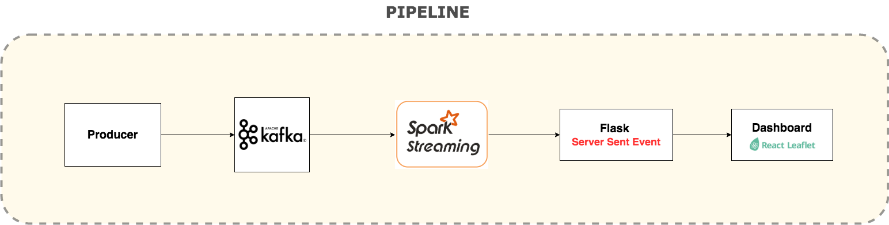

## Spark Streaming Application 
Monitor the N.Y. taxi supply/demand (S/D) ratio in real time.

## DEMO

## Pipeline

   **TL;DR** 
   
   First read the raw date from Kafka (Mock by MemoryStream). 
   We project out `Taxi` data by schema. Then we apply the `withSupplyDemand()`.
   Next, We run the aggregation onto the returned DataFrame by the sliding window.
   Lastly, We will call Flask API with the aggregated result.

## Testing
run `sbt test`

1. rich test

    Test the `withSupplyDemand()` transformation that projects two "supply" and "drop" columns by the assumption
    if it works as expected.

2. End-End streaming test 
    
   Test the count after aggregating if is equal to our expected count

            

